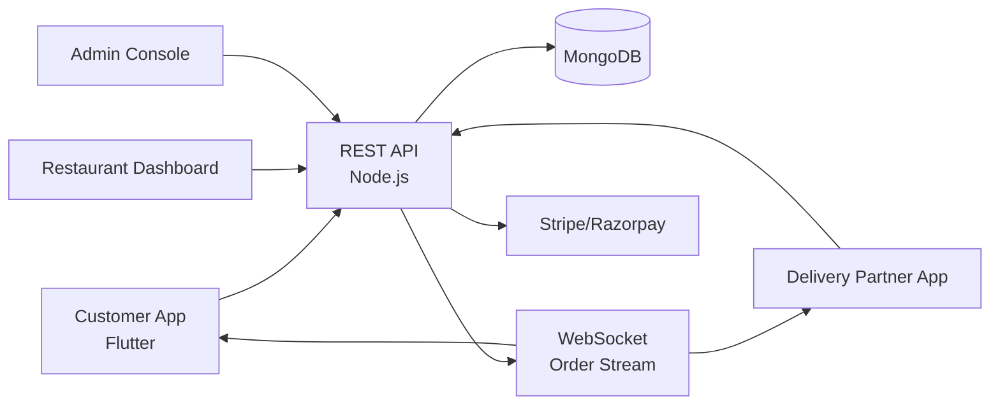

# Zomato Clone — White-Label Food Delivery & Restaurant Ordering Platform by Miracuves

**MXFeast** is a production-ready, white-label Zomato clone: a complete food-delivery platform with customer, restaurant, and delivery-partner apps — delivered with **100% source code ownership** in **6 working days**.

> 🍔 **See it running before you talk to anyone.** Live customer app, restaurant panel, rider app, and admin console — demo credentials are printed on the [solution page](https://miracuves.com/zomato-clone#demo). No sales call required.

---

## 🚀 Live Demos

| Environment | URL | What you can test |
|---|---|---|
| 📱 Customer App (Android) | [mas.mimeld.com](https://mas.mimeld.com) | Browse restaurants, customize orders, track delivery, pay, rate |
| 🍽️ Restaurant Panel | [Solution page → Demo](https://miracuves.com/zomato-clone#demo) | Manage menu, orders, prep time, analytics, payouts |
| 🛵 Delivery Partner App | [Solution page → Demo](https://miracuves.com/zomato-clone#demo) | Accept orders, navigate, batch deliveries, track earnings |
| 🛠️ Admin Console | [Solution page → Demo](https://miracuves.com/zomato-clone#demo) | Restaurants, commissions, zones, disputes, finance reports |

Demo credentials for all environments: **[miracuves.com/zomato-clone → Demo section](https://miracuves.com/zomato-clone/#demo)**

---

## ✨ What Makes This Zomato Clone Different

Most food-delivery scripts stop at "browse + cart + checkout." This platform ships with the features that actually run a restaurant-delivery *business*:

- **Commission-Free Tier** — let restaurants opt for a 0%-commission self-delivery mode — same app, their riders, your platform revenue from premium features
- **Multi-Cart Group Orders** — office teams order from 3+ restaurants in one cart with one delivery fee — the feature corporate clients actually pay for
- **Cloud Kitchen Native** — dark stores, virtual brands, KDS (kitchen display), and packaging rules built in — not bolted on as a settings page
- **Dine-In + Delivery Unified** — one menu serves QR-table-ordering, takeaway, and delivery — restaurants don't manage three separate systems
- **AI Demand Forecasting** — predicts order volume per zone per hour so restaurants pre-prep and riders pre-position — cuts wait times 20%

## 📦 Core Features

**Customer:** browse restaurants · cuisine search · order customization · scheduled delivery · live tracking · multi-payment · ratings · 1-tap reorder · group orders · in-app chat

**Restaurant:** menu builder · order management · prep-time settings · delivery radius · sales analytics · promo tools · payout requests · in-app chat

**Delivery Partner:** auto-assigned orders · navigation · multi-order batching · earnings dashboard · instant pay · performance score

**Admin:** restaurant onboarding · commission engine · delivery zone management · dispute resolution · dynamic commission · finance reports

## 🏗️ Architecture

**Stack:** Flutter mobile apps · Node.js or Laravel backend · MongoDB or PostgreSQL · real-time order stream via WebSocket · Stripe, Razorpay & regional gateways · Google Maps / Mapbox for routing

## 📋 What’s Included

- ✅ Full source code — backend, web, mobile apps, panels (no encryption, no license locks)
- ✅ Deployment to your servers & app store submission assistance
- ✅ Your branding — white-label rename, logo, colors, domain
- ✅ 60 days post-launch support + 12 months of free updates
- ✅ Documentation & handover

**Pricing:** from **$3,399**, transparent on the [solution page](https://miracuves.com/zomato-clone/#pricing) — no "contact us for quote" games.

## 🆚 Why Not Build From Scratch?

Custom food-delivery platforms run $80k–$400k and 6–12 months. A proven white-label base gets you to market in 6 working days for a fraction of that, with your budget preserved for restaurant onboarding and rider incentives.

## 📚 Resources

- 📖 [Zomato Clone — Full Solution Page](https://miracuves.com/zomato-clone) (features, pricing, demos, FAQ)
- 💰 [How Much Does a Food Delivery App Cost in 2026?](https://miracuves.com/zomato-clone#pricing) pricing breakdown & what's included
- 📝 [Best Zomato Clone Script in 2026](https://miracuves.com/zomato-clone/blog/) features, pricing & launch guide
- 🧠 [Why Cloud Kitchens Need a Different POS](https://miracuves.com/zomato-clone/blog/) KDS, virtual brands, packaging rules
- ✅ [Miracuves Facts & Claims Ledger](https://miracuves.com/zomato-clone/facts/) every claim we make, verified

## 🏢 About Miracuves

[Miracuves Solutions](https://miracuves.com) builds white-label clone apps and custom software from Mumbai, India — 90+ ready-made solutions, live demos for every product, transparent pricing, and delivery in 6 working days. Operating since 2010.

**Talk to us:** [WhatsApp](https://wa.me/919830009649) · [Schedule a consultation](https://miracuves.com/schedule-consultation/) · [miracuves.com](https://miracuves.com)

---

### ⚠️ Note on This Repository

This repository is a product overview. The full source code is delivered to clients on purchase — see [what’s included](https://miracuves.com/zomato-clone/#included). For a hands-on evaluation, use the live demos above; credentials are public on the solution page.

*Keywords: zomato clone, zomato clone script, food delivery app development, restaurant ordering, white label food delivery, cloud kitchen, Flutter food app, Node.js food platform*

---

<!--
══════════════════════════════════════════════════
TEMPLATE VARIABLE KEY — auto-generated from Netflix-Clone pattern
══════════════════════════════════════════════════
{APP_NAME}        Zomato Clone
{MX_NAME}         MXFeast
{CATEGORY}        Food Delivery & Restaurant Ordering Platform
{DEMO_WEB}        mxfeast.mimeld.com
{PRICE}           $3,399
{SLUG}            zomato-clone
{SOLUTION_URL}    https://miracuves.com/zomato-clone/
{VERTICAL}        food_delivery

See /tmp/verticals/food_delivery.txt for the vertical config used to generate this README.
══════════════════════════════════════════════════
-->